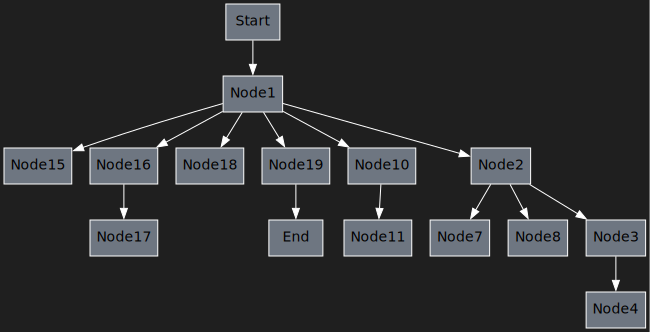
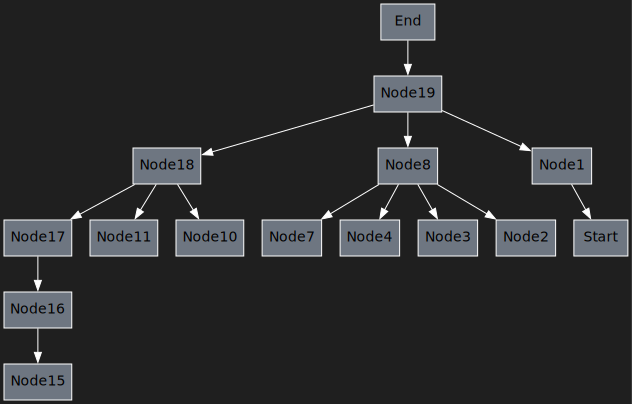

# Graph topological sorting and dominator tree building

## Topological sorting


## Dominator tree



## Postdominator tree



## Build dependencies

- `C++ 20` compiler
- `CMake`

## Build

```bash
cmake -S . -B <build_dir> -DCMAKE_BUILD_TYPE={Debug, Release} [-DUSE_SANITIZER='Address;Undefined'] [-DENABLE_TESTS=ON]
cmake --build <build_dir>
```

E.g:

```bash
cmake -S . -B build -DCMAKE_BUILD_TYPE=Debug -DUSE_SANITIZER='Address;Undefined' -DENABLE_TESTS=ON
cmake --build build
```

## Dependencies

- `dot` - graphviz tool for graph visualization

## Usage

```
Directed Acyclic Graph topological sorting and dominator tree building
Usage:
  graphs [OPTION...] <input>

  -i, --input arg     Input file with graph description
  -d, --dump_dir arg  Dump directory (default: dumps/)
  -h, --help          Print help
```

E.g:
```bash
./build/graphs tests/example.txt
```

This will produce directory `dumps` with several dumps in it

### Input tree format

One line specifies node's children:
```
<node index> [<children indexes>...]
```

E.g:
```
3 5 7 2
5 9
7 9
```

Graph must be acyclic. Each node mustn't be defined more than once

## Tests

Use CMake CTest to run tests

```bash
ctest --build-dir build
```

## Credits

MIPT Baikal Electronics department Compiler Technologies course task

